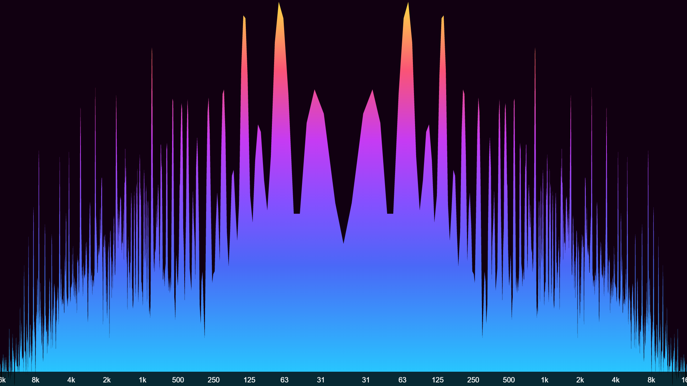
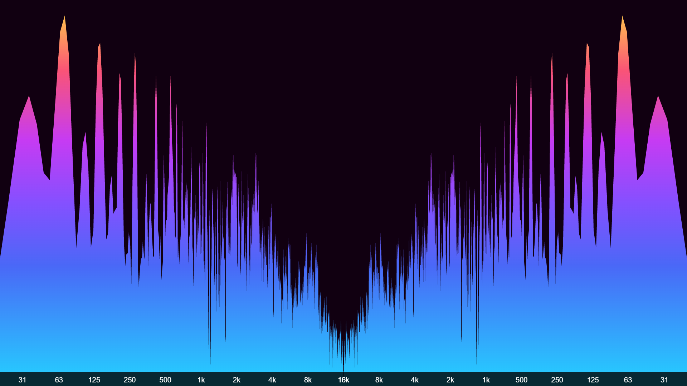

# Advanced Panel

Click **Advanced** in the panel selection buttons to open the Advanced Panel.

Advanced settings are listed below in alphabetical order.

## Bar Spacing

The amount of spacing between analyzer bars. This setting is only effective in [Bars mode](settings.md#analyzer-mode).

## Channel Layout

Selects single or dual channel display, with different layout options:

| Channel Layout | Description |
|----------------|-------------|
| **Single**     | Single channel analyzer, representing the combined output of all channels (stereo or surround).
| **Comb**       | Dual channel analyzer, both channels overlaid. Works best with [**Line Graph** mode](settings.md#analyzer-mode) or [**OUTLINE**](settings.md#effects-switches) switch on.
| **Horiz**      | Dual channel, side by side - see [Mirror](settings.md#mirror) for additional layout options.
| **Vert**       | Dual channel, left channel at the top half of the canvas and right channel at the bottom.

The channel layout setting does NOT affect stereo audio output.

?> Surround audio output is currently only supported with **Single** channel layout, and must be enabled in [Configuration > General settings](configuration.md#enable-51-surround-audio-output-experimental).

## FFT Size

Number of samples used for the [Fast Fourier Transform](https://en.wikipedia.org/wiki/Fast_Fourier_transform) performed by the analyzer.

Higher values provide greater detail in the frequency domain (especially for low frequencies), but less detail in the time domain (slower response to changes).
The default value of **8192** usually provides the best cost/benefit ratio for both domains.

## FFT Smoothing

Averaging factor used to smooth FFT data between analysis frames.

Lower values make the analyzer react faster to changes, and may look better with faster tempo songs and/or larger FFT sizes.
Increase it if the analyzer animation looks too "jumpy".

## Fill Opacity

Transparency of the graph area or bar fill. The [ALPHA](settings.md#alpha) switch, when active, has precedence over the Fill Opacity (for Bars mode only).

Effective only for **Graph** [analyzer mode](settings.md#analyzer-mode) or when [OUTLINE](settings.md#effects-switches) switch is on.

!> On **Firefox**, Fill Opacity may not work properly with [Radial](settings.md#effects-switches) analyzer, due to [this bug](https://bugzilla.mozilla.org/show_bug.cgi?id=1164912).

## Frequency Range

The lowest and highest frequencies represented in the spectrum analyzer. You can use this feature to "zoom in" a specific frequency range.

## Frequency Scale

| Scale      | Frequency distribution preview
|------------|-----------------------------------
| **Bark**   | 
| **Linear** | 
| **Log**    | 
| **Mel**    | 

The logarithmic scale allows proper visualization of **octave bands** (see [Band Count](settings.md#band-count)) and provides the best results when using the [**Notes**](settings.md#x-axis-label) labels on the X-axis.

[*Bark*](https://en.wikipedia.org/wiki/Bark_scale) and [*Mel*](https://en.wikipedia.org/wiki/Mel_scale) are perceptual pitch scales, which may provide better visualization of mid-range frequencies, when compared to log or linear scales.

## Import / Export Settings

Click **Export** to download all current settings in the **Settings** and **Advanced** panels as a JSON file. Use it to [share](https://github.com/hvianna/audioMotion.js/discussions/categories/presets) and store backup copies of your favorite settings.

Click **Import** to load settings from an external JSON file. Please note that this will overwrite all current settings in both the **Settings** and **Advanced** panels.

You can also import [downloaded presets](settings.md#save-manage-presets) this way.

## Level Scale

Switch between Decibels and Linear scale to represent sound levels in the frequency spectrum.

## Line Width

Thickness of the graph line or outline stroke.

Effective only for **Graph** [analyzer mode](settings.md#analyzer-mode) or when [OUTLINE](settings.md#effects-switches) switch is on.

## Mirror

Selects whether the analyzer graphics should be mirrored to the left (low frequencies at the center) or to the right (high frequencies at the center).

When [Channel Layout](#channel-layout) is set to **Horiz**, this setting modifies the direction of the left or right channels.

| Mirror: Left | Mirror: Right |
|:-----------:|:-------------:|
|  | 

## Octave Bands

Switch between using the [ANSI/IEC preferred frequencies](https://archive.org/details/gov.law.ansi.s1.11.2004) or the [equal-tempered scale](http://hyperphysics.phy-astr.gsu.edu/hbase/Music/et.html) to compute center and edge frequencies of [octave bands](settings.md#band-count).

When [Frequency Scale](#frequency-scale) is set to **Log** this will also reflect in the [frequency labels](settings.md#x-axis-labels) displayed in the X-axis, representing the center frequencies of each octave.

Octave Bands | Octaves center frequencies
-------------|------------------------------
Tempered     | 
ANSI/IEC     | 

## Radial Size

Configure the radius of the radial analyzer, when [RADIAL](settings.md#effects-switches) switch is on.

## Radial Spin

Configure the radial analyzer spinning speed, when [RADIAL](settings.md#effects-switches) switch is on.

## Weighting Filter

[Weighting filter](https://en.wikipedia.org/wiki/Weighting_filter) applied to frequency data for spectrum visualization.

Each filter applies a different curve of gain/attenuation to specific frequency ranges, but the general idea is to adjust the
visualization of frequencies to which the human ear is more or less sensitive.

?> Weighting filters **do NOT** affect audio output. Some filters may impact performance, due to increased real-time data processing.

