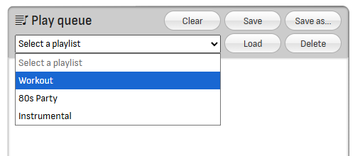
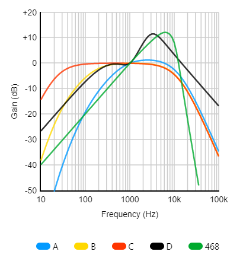
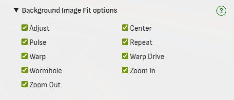
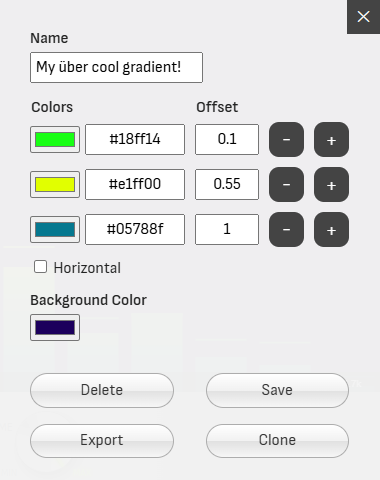
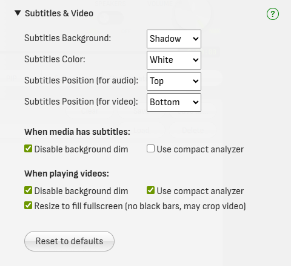

# User's Manual


## Front Panel


### Source selection


Toggles between using the app's own media player or your microphone as the audio source for the analyzer.

If your sound card and operating system support *Stereo mix* mode, it should also appear as an input device option when you set the Source to **MIC.**<br>
*Stereo mix* allows audioMotion to receive audio generated by any program running in your PC.

?> When Source is set to **MIC**, output to the speakers is automatically turned off to prevent feedback loop. (See [Speakers and Volume](#speakers-and-volume))

### Player controls

These are your standard media control buttons.

| button | action |
|:------:|:-------|
|  | Play / pause |
|  | Previous track - Hold to rewind |
|  | Stop playback and reset the queue pointer to the first song |
|  | Next track - Hold to fast forward |
|  | Shuffle queue and start playback |
|  | Toggle queue repeat |

Below the player controls you'll find the current track's elapsed time, progress bar and remaining time.


You can drag the progress bar cursor to fast forward or rewind, or click anywhere on the bar to quickly jump to the relative position on the track.

### Speakers and Volume


The **Speakers** switch enables or disables audio output to your speakers or headphones.

When [Source](#source-selection) is switched to MIC, Speakers are automatically turned off to prevent audio feedback loop.
If you're using headphones you can safely turn it on, in order to hear the input audio.

Hover the mouse over the **Volume** knob and use the **mouse wheel** to turn the volume up or down (if the scroll direction doesn't feel natural to you, invert its behavior in Configuration > General settings).

Volume can also be adjusted with the **Up** and **Down** arrow keys.

### Panel selection buttons

- **Media** - opens the [Media Panel](#media-panel)
- **Settings** - opens the [Settings panel](#settings-panel)
- **Advanced** - opens the [Advanced panel](#advanced-panel)
- **Console** - opens the message [Console](#console)

### Collapse/expand front panel

Click the  button to collapse or expand the front panel. When collapsed, the analyzer area is increased.

### Function buttons

- **PIP** - displays the spectrum analyzer in a Picture-In-Picture window
- **Fullscreen** - displays the spectrum analyzer in fullscreen
- **Configuration** - opens the app [Configuration](#configuration) panel
- **Help** - opens the help panel, where you can check **audioMotion**'s version, documentation links and [keyboard shortcuts](#keyboard-shortcuts)

## Media Panel

Click **Media** in the panel selection buttons to open the Media Panel.


The Media Panel is comprised of the **File Explorer** on the left side, the action buttons at the center, and the **Play Queue** on the right.


### Supported file formats

+ Audio: **flac**, **m4a**, **mp3**, **ogg** and **wav**;
+ Video *(for playback and [Background](#background))*: **mkv**, **mpg**, **webm**, **mp4**, **avi** and **mov**;
+ Images *(for folder covers and [Background](#background))*: **jpg**, **jpeg**, **webp**, **avif**, **png**, **gif** and **bmp**;
+ Playlists *(see [Playlist files](#playlist-files))*: **m3u** and **m3u8**;
+ Subtitles *(see [Subtitles](#subtitles))*: **vtt**.

*Actual codec support may vary, depending on browser and operating system.*

### File Explorer

The **File Explorer** allows you to navigate through your media folders and files.

!> Access to your device is provided to the app by the [File System Access API](https://caniuse.com/native-filesystem-api),
which is currently **only implemented on Chromium-based browsers** (e.g., Chrome, Opera and Edge).
On **Brave browser** it needs to be enabled in `chrome://flags/#file-system-access-api` (copy and paste it in the address bar).

**Double-click** a file to quickly add it to the play queue. It will also start playing if the player is currently stopped.

Hold **Ctrl** and click to select multiple files, or **Shift** + click to select a range of files.

You can then **drag and drop** the selected files into the play queue, or use the action buttons:

| button | action |
|:------:|:-------|
**Switch to<br>Server / Device** | Switches between browsing folders on your local device or the songs hosted on the app server
**Add selected**  | Add currently selected files in the file explorer to the play queue
**Add all files** | Add all files in the current folder to the play queue
**Add from URL**  | Load a remote audio file or stream from an URL
**Open file**     | Open and play a single media file from your device<br>*(Only displayed on browsers with no support for the File System Access API)*

?> The first image found in the current folder will be shown in the background of the file explorer, with precedence given to filenames containing the words *cover*,
*folder* or *front* (in this order).

### Play queue and saved playlists

**Double-click** a queued song to play it.

Drag and drop songs to reorder them inside the queue. Hold **Ctrl** and click to select multiple files, or **Shift** + click to select a range.
Press **Delete** (*Backspace* on Mac) to remove selected songs from the queue.

Click the **Clear** button to clear the play queue.

The contents of the play queue are automatically restored the next time you open audioMotion. You can disable this feature in [Config - General settings](#general-settings).

**You can also save the play queue to internal named playlists for quick access.**

Saved playlists appear in the playlist selection box, as shown below:



Create and manage your playlists using the following buttons:

| Button | Action |
|:-------|:-------|
**Save as...** | Saves the current queue contents to a new playlist
**Save**       | **Update the selected playlist** with the current queue contents
**Load**       | Load the selected playlist, **adding** its contents to the end of the current queue
**Delete**     | Permanently delete the selected playlist

!> Saved playlists are stored in the browser's internal storage and will only be accessible in the same browser they were saved.

### Playlist files

The File Explorer can load playlist files in M3U format (*.m3u* or *.m3u8* extensions), which are basically text files with one filename per line.

The [Extended M3U format](https://en.wikipedia.org/wiki/M3U#Extended_M3U)'s `#EXTINF` and `#EXTALB` directives are also supported,
and allow adding artist names, album and song titles for media files that don't have embedded metadada.

Playlist entries may include folder names, including `..` to access upper-level folders, but **all paths must be relative to the location of the .m3u file itself,**
i.e., paths **must not** start with a slash or drive letter.

Playlists can also include remote media files and streams, using **https://** protocol.

Example of an .m3u file:

```
#EXTM3U
#
# See https://en.wikipedia.org/wiki/M3U#Extended_M3U for format reference.
#
# Note: EXTALB is applied to all songs that come after it, no need to repeat it.
#
#EXTALB:Animals (1977)
#EXTINF:84,Pink Floyd - Pigs on the Wing. Part 1
track01.mp3
#EXTINF:1025,Pink Floyd - Dogs
track02.mp3
#EXTINF:686,Pink Floyd - Pigs (Three Different Ones)
track03.mp3
#EXTINF:619,Pink Floyd - Sheep
track04.mp3
#EXTINF:85,Pink Floyd - Pigs on the Wing. Part 2
track05.mp3
```

### Subtitles

**audioMotion** can display subtitles in WebVTT format (.vtt), for video and audio files.


**Subtitle files must be in the same folder and have the same base name of its corresponding media file, with a lowercase .vtt extension.**

Media files with detected subtitles will show a **[SUBS]** badge next to their names in the File Explorer, as shown below:


Configure the subtitles appearance in **[Config - Subtitles configuration](#subtitles-configuration).** Toggle the display of subtitles with the [**SUBTITLES** switch](#display).

?> Download synced lyrics for your songs with [LRCGET](https://github.com/tranxuanthang/lrcget) and use [Subtitle Edit](https://github.com/SubtitleEdit/subtitleedit)
to convert them (and other popular subtitle formats) to .vtt.

## Settings Panel

Click **Settings** in the panel selection buttons to open the Settings Panel.


### Presets

<div class="settings-panel highlight-preset"></div>

**audioMotion comes with 6 built-in presets and provides 9 slots for user-defined presets.**

The **Demo** preset picks random settings and sets [**Randomize**](#randomize) to 15 seconds, so it's a great way to quickly overview all of audioMotion's features!

Description of buttons functions:

Button            | Action
------------------|-----------
**Load**          | Load the selected preset
**Session start** | Restore settings as they were when you last launched (or reloaded) the app
**Defaults**      | Resets all settings to their initial values, as in the first time you run audioMotion
**Save / Manage** | Save, update, rename or delete user presets

Keyboard shortcuts available:

Key               | Action
------------------|-----------
**0** (zero)      | Choose random values for all settings enabled in [Configuration > Randomize settings](#randomize-settings)
**1 - 9**         | Load the user preset of corresponding slot number
**Shift + 1 - 9** | Save the current settings to the corresponding user preset slot number

Your last used settings will be automatically restored the next time you open audioMotion.

?> NOTE: presets save/restore the settings from both the **Settings** and **Advanced** panels!

!> User presets are saved to the browser's storage and will only be accessible in the same browser they were saved. Backup your presets using the Export feature! <<<<<<<<<

### Randomize

<div class="settings-panel highlight-randomize"></div>

Selects random visualization settings on track change or time interval.

You can choose which settings may be changed by Randomize in [Configuration > Randomize settings](#randomize-settings).

### Analyzer Mode

<div class="settings-panel highlight-mode"></div>

Selects the visualization mode. Keyboard shortcut: **M** / **Shift + M**.

| Analyzer&nbsp;Mode | Description |
|------|-------------|
| **Bars** | When [Frequency Scale](#frequency-scale) is set to **LOG**, each bar represents the *n*th part of an octave, otherwise the frequency spectrum is divided in the number of bands selected by [Band Count](#band-count).
| **FFT** | Displays individual discrete frequencies, as provided by the [FFT](https://en.wikipedia.org/wiki/Fast_Fourier_transform) computation.
| **Graph** | Uses the FFT data points to create an area or line graph - the [line width](#line-width) and [fill opacity](#fill-opacity) can be customized in the Advanced panel.

### Band Count

<div class="settings-panel highlight-band-count"></div>

How many frequency bands should be displayed in **Bars** [analyzer mode](#analyzer-mode), or what octave fraction should be used for each band.

When [Frequency Scale](#frequency-scale) is set to **Log**, this setting defines how much of an octave is covered by each bar.
Otherwise, the frequency spectrum is divided in a fixed amount of bars, with the bandwidth of each bar varying according to the selected frequency scale.

See also [X-Axis Labels](#x-axis-labels).

### Bar Color Mode

<div class="settings-panel highlight-color-mode"></div>

Desired method for coloring the analyzer bars. This property has no effect in **Graph** [analyzer mode](#analyzer-mode).

| Color&nbsp;Mode | Description | Preview ('prism' gradient)
|-----------------|-------------|----------------------------
| **Gradient**    | Analyzer bars are painted with the currently selected [Gradients](#gradients). | 
| **Index**       | Each analyzer bar is painted with a **single color** from the selected gradients, starting with the first color applied to the first bar, and so on, cycling through the available colors. | 
| **Level**       | Colors from the selected gradient are used to paint each bar, according to its current level (amplitude). | 

### Sensitivity

<div class="settings-panel highlight-sensitivity"></div>

Adjusts the analyzer sensitivity to improve the visualization of songs too quiet or too loud. Keyboard shortcut: **N** / **Shift + N**.

Presets for low, medium and high sensitivity can be customized in **[Configuration > Sensitivity presets](#sensitivity-presets).**

### Gradients

<div class="settings-panel highlight-gradients"></div>

Select color gradients for analyzer channels. Keyboard shortcut: **G** / **Shift + G**.

Button / switch | Description
----------------|------------
**LINK**        | When active and using a dual [Channel Layout](#channel-layout), uses the same gradient for both channels.
**SPLIT**       | When active, splits gradient colors between both channels (**Vertical** [channel layout](#channel-layout) only).
**Manage Gradients** | Click to create, edit, import and export gradients - see [Configuration > Gradient management](#gradient-management).

### Background

<div class="settings-panel highlight-background"></div>

Selects the analyzer background.

| Background | Description |
|------------|-------------|
| **Gradient default** | Uses the background color defined by the currently selected gradient - when the [LED switch](#effects) is on, this shows the "unlit" LEDs instead |
| **Black** | Uses a black background |
| **Album cover** | Displays the album cover for the current song<sup> (1)</sup> |
| **Random image** | Selects a random image from the backgrounds folder<sup> (2)</sup> |
| **Random video** | Selects a random video from the backgrounds folder<sup> (2)</sup> |

<sup>**( 1 )**</sup> Album covers will be preferably retrieved from the file's metadata. When a picture is not found in the metadata, **audioMotion** will look for image files
in the song's folder, and will pick any image which filename contains the words *cover*, *folder* or *front* (in this order), or the first image found otherwise.

<sup>**( 2 )**</sup> The web app includes a few built-in background images and videos. **You can select your own backgrounds folder in [Config - General settings](#background-media-source).**
You can also customize [how many files will be directly available](#background-media-max-items) in the selection box, but for large amounts of files use the *Random image* and *Random video* options to randomly choose among **all** files found in the backgrounds folder.

See also [Background Image Fit](#background-image-fit) and [Background Dim](#background-dim) settings for additional options for background images and videos.

You can cycle through the available options using the **B** keyboard shortcut.

?> **When a video file is loaded on the player** the Background setting has no effect, but you can still adjust the [Background Dim](#background-dim).

### Background Image Fit

<div class="settings-panel highlight-bgimagefit"></div>

Selects the size and positioning of the background image. Keyboard shortcut: **Shift + B**.

Effective only when [Background](#background) is set to an image or **Album cover**.

| Background Image Fit | Effect |
|----------------------|--------|
**Adjust** | Resizes the image so it fills the entire canvas
**Center** | Displays the image horizontally centered on the canvas (default)
**Pulse** | Makes the image pulsate to the beat of the song
**Repeat** | Repeats the image horizontally to fill the canvas
**Warp** | Applies a 3D "warp" effect to the background image
**Warp Drive** | Animated *Warp* effect
**Wormhole** | *Warp Drive* effect with additional rotation
**Zoom In** | Image is initially centered on the canvas and slowly zooms in as the song plays
**Zoom Out** | Image is initially enlarged at 200% and slowly zooms out as the song plays

Effects can be selectively disabled in [Configuration > Background Image Fit](#background-image-fit-options).

!> The **Warp Drive** and **Wormhole** effects may degrade performance on some graphics cards.

### Background Dim

<div class="settings-panel highlight-background-dim"></div>

Adjusts the brightness of images and videos shown in the background of the spectrum analyzer.

**By default, Background Dim is disabled when playing a video track or displaying subtitles.** This behavior can be configured in [Configuration > Subtitles & Video](#subtitles-video).

### Effects

<div class="settings-panel highlight-effects"></div>

Other visualization effects and modifiers.

Effect      | Description
------------|--------------
**ALPHA**   | Toggle variable bar transparency - when active, the higher the bar amplitude the more opaque it is
**LUMI**    | Toggle luminance bars - similar to ALPHA, but all analyzer bars are displayed at full-height *(no effect with RADIAL)*
**LEDS**    | Toggle LED effect for the analyzer bars *(Bars mode only, no effect with RADIAL)*
**OUTLINE** | Toggle bar outline - see [Line Width](#line-width) and [Fill Opacity](#fill-opacity) settings *(Bars mode only)*
**RADIAL**  | Toggle display of circular spectrum analyzer with radial bars. **This option disables both LEDS and LUMI effects.**
**ROUND**   | Toggle rounded corners at the top of analyzer bars *(Bars mode only)*

### Reflex

<div class="settings-panel highlight-reflex"></div>

Selects a vertical reflection effect. On **Bars** [Analyzer Mode](#analyzer-mode), this setting has no effect when the [LUMI](#effects) switch is active.

Reflex: 40% | Reflex: Mirrored
----------- |-----------------
 | 

### Display

<div class="settings-panel highlight-display"></div>

Toggle display and performance options

Display        | Description
---------------|-------------
**TRACK INFO** | Toggle on-screen display of song information on every track change
**SUBTITLES**  | Toggle display of [subtitles](#subtitles)
**FLAT**       | Switch between outlined (on) or shadowed (off) text for messages displayed on canvas
**LO-RES**     | Toggle low resolution mode *(may improve performance, especially on 4K+ displays)*
**FPS**        | Toggle display of current frame rate at the top right corner

### Peaks

<div class="settings-panel highlight-peaks"></div>

Toggle display of amplitude peaks.

Peaks | Description
------|-------------
Off   | Do not show amplitude peaks
Drop  | Peaks fall down after a short time
Fade  | Peaks fade out after a short time

Drop and Fade behavior can be customized in [Configuration > Peaks behavior](#peaks-behavior).

### X-Axis Labels

<div class="settings-panel highlight-x-labels"></div>

Toggle display of scale labels on the horizontal axis (frequency). Keyboard shortcut: **S** / **Shift + S**.

X-Axis Labels | Description
--------------|-------------
Off           | Do not show labels
Freqs         | Show frequency values
Notes         | Show musical notes - works best with [Frequency Scale](#frequency-scale): **Log**, [Octave Bands](#octave-bands): **Tempered** and [Band Count](#band-count): **1/12th octave**.

### Y-Axis Labels

<div class="settings-panel highlight-y-labels"></div>

Toggle display of scale labels on the vertical axis (level/volume). Keyboard shortcut: **S** / **Shift + S**.


## Advanced Panel

Click **Advanced** in the panel selection buttons to open the Advanced Panel.


### Channel Layout

<div class="advanced-panel highlight-channel-layout"></div>

Selects single or dual channel display, with different layout options:

| Channel Layout | Description |
|----------------|-------------|
| **Single**     | Single channel analyzer, representing the combined output of all channels (stereo or surround).
| **Comb**       | Dual channel analyzer, both channels overlaid. Works best with [**Line Graph** mode](#analyzer-mode) or [**OUTLINE**](#effects) switch on.
| **Horiz**      | Dual channel, side by side - see [Mirror](#mirror) for additional layout options.
| **Vert**       | Dual channel, left channel at the top half of the canvas and right channel at the bottom.

The channel layout setting does NOT affect stereo audio output.

?> Surround audio output is currently only supported with **Single** channel layout, and must be enabled in [Configuration > General settings](#general-settings).

### Mirror

<div class="advanced-panel highlight-mirror"></div>

Selects a horizontal mirroring effect to the left (low frequencies at the center) or to the right (high frequencies at the center).

| Mirror: Left | Mirror: Right |
|:-----------:|:-------------:|
|  | 

### Import / Export Settings

<div class="advanced-panel highlight-import-export"></div>


### Bar spacing

<div class="settings-panel highlight-bar-spacing"></div>

This setting is effective only when an [octave bands mode](#analyzer-mode) is selected. Avaliable options are:

| Bar Spacing | Description |
|-------------|-------------|
**MIN** | ~1px spacing between analyzer bars
**10**  | 10% spacing, 90% bar width (default)
**25**  | 25% spacing, 75% bar width
**50**  | 50% spacing, 50% bar width
**75**  | 75% spacing, 25% bar width

### Fill Opacity

<div class="settings-panel highlight-fill-opacity"></div>

Transparency of the graph area or bar fill. The [ALPHA](#effects) switch, when active, has precedence over the Fill Opacity (for Bars mode only).

Effective only for **Graph** [analyzer mode](#analyzer-mode) or when [OUTLINE](#effects) switch is on.

!> On **Firefox**, Fill Opacity may not work properly with [Radial](#effects) analyzer, due to [this bug](https://bugzilla.mozilla.org/show_bug.cgi?id=1164912).

### Line Width

<div class="settings-panel highlight-line-width"></div>

Thickness of the graph line or outline stroke.

Effective only for **Graph** [analyzer mode](#analyzer-mode) or when [OUTLINE](#effects) switch is on.

### Radial Size

<div class="advanced-panel highlight-radial-size"></div>

Configure the radius of the radial analyzer, when [RADIAL](#effects) switch is on.

### Radial Spin

<div class="advanced-panel highlight-radial-spin"></div>

Configure the radial analyzer spinning speed, when [RADIAL](#effects) switch is on.

### Frequency Range

<div class="advanced-panel highlight-frequency-range"></div>

The lowest and highest frequencies represented in the spectrum analyzer. You can use this feature to "zoom in" a specific frequency range.

### Frequency Scale

<div class="advanced-panel highlight-frequency-scale"></div>

| Scale    | Description | Frequency distribution preview (10Hz - 24kHz range)
|----------|-------------|-----------------------------------
| **BARK** | Bark scale | 
| **LIN**  | Linear scale | 
| **LOG**  | Logarithmic scale | 
| **MEL**  | Mel scale | 

Logarithmic scale allows the visualization of proper **octave bands** (see [Analyzer Mode](#analyzer-mode)) and it's also recommended when using the [**NOTES**](#x-axis-label) switch.

[*Bark*](https://en.wikipedia.org/wiki/Bark_scale) and [*Mel*](https://en.wikipedia.org/wiki/Mel_scale) are perceptual pitch scales, which may provide better visualization of mid-range frequencies, when compared to log or linear scales.

### Level Scale

<div class="advanced-panel highlight-level-scale"></div>

**LINEAR**  | Switch between linear scale and decibels (logarithmic) to represent bar amplitudes

### Octave Bands

<div class="advanced-panel highlight-octave-bands"></div>

**ANSI**    | Switch between [ANSI/IEC preferred frequencies](https://archive.org/details/gov.law.ansi.s1.11.2004) and [equal-tempered scale](http://hyperphysics.phy-astr.gsu.edu/hbase/Music/et.html) to generate octave bands

### FFT Size

<div class="advanced-panel highlight-fft-size"></div>

Number of samples used for the [Fast Fourier Transform](https://en.wikipedia.org/wiki/Fast_Fourier_transform) performed by the analyzer.

Higher values provide greater detail in the frequency domain (especially for low frequencies), but less detail in the time domain (slower response to changes).
The default value of **8192** usually provides the best cost/benefit ratio for both domains.

### FFT Smoothing

<div class="advanced-panel highlight-fft-smoothing"></div>

Averaging factor used to smooth FFT data between analysis frames.

Lower values make the analyzer react faster to changes, and may look better with faster tempo songs and/or larger FFT sizes.
Increase it if the analyzer animation looks too "jumpy".

### Weighting Filter

<div class="advanced-panel highlight-weighting"></div>

[Weighting filter](https://en.wikipedia.org/wiki/Weighting_filter) applied to frequency data for spectrum visualization.

Each filter applies a different curve of gain/attenuation to specific frequency ranges, but the general idea is to adjust the
visualization of frequencies to which the human ear is more or less sensitive.



?> Weighting filters **do NOT** affect audio output. Some filters may impact performance, due to increased real-time data processing.


## Configuration

Click **Config** in the top panel buttons to open the Configuration panel.


### Analyzer Modes


Uncheck modes to remove them from the [Analyzer Mode](#analyzer-mode) selection box.

### Background Image Fit options



Uncheck options to remove them from the [Background Image Fit](#background-image-fit) selection box.

### General settings


#### Background media source

Choose the source for [Background](#background) images and videos, or disable this feature.

When set to *Local folder*, only files in the selected folder will be loaded (subfolders are ignored).
Requires browser support for the [*File System Access API*](known-issues.md).

#### Background media max items

Choose the maximum number of media files that can be directly selected in the [Background](#background) setting.

If your backgrounds folder contains more files, the remaining ones will only be selectable via the *Random image* or *Random video* options.

#### Fullscreen height (%)

Height of the analyzer when in fullscreen. This can be used to provide a wider look to the fullscreen analyzer.

You can also use the **Shift** + **Up** and **Down** arrows to adjust the analyzer height during fullscreen visualization.

#### Maximum frame rate (FPS)

Maximum desired animation frame rate, in frames per second.

*'Unlimited'* will try to match your monitor's refresh rate, but may increase CPU usage.

#### On-screen display font size

Base font size used for information displayed on canvas.

#### PIP aspect ratio

Choose the aspect ratio of the Picture-In-Picture window.

After entering PIP, the window can be resized and the selected aspect ratio will be preserved.

#### Auto-hide media panel on analyzer hover

Automatically hides the [Media Panel](#media-panel) when you move the mouse cursor over the analyzer area.

Move the cursor to the bottom of the window, or click the [**Settings** button](#top-panel-buttons) to show the panel again.

#### Disable Background Dim when playing video

Ignore the [Background Dim](#background-dim) setting when playing a video track.

#### Disable Background Dim when showing subtitles

Ignore the [Background Dim](#background-dim) setting when showing subtitles for the current track.

#### Remember last music folder

Start the file explorer in the last previously used folder the next time you open audioMotion.

#### Remember play queue contents

Automatically restores the contents of the play queue the next time you open audioMotion.


### Gradients configuration


Uncheck gradients to remove them from the [Gradients](#gradients) selection box.

### Gradient Editor

Click the **Add Gradient** button to create a new color gradient, or click any custom gradient to edit it.



At least two colors are required to create a gradient, but you can add as many colors as you like.
The **offset** must be a number between 0 and 1 - use it to adjust the position of each color inside the gradient.

!> Custom gradients are saved to the browser's storage and will only be accessible in the same browser they were saved.

### On-screen information display options


Customize how long information is displayed on screen when user clicks the analyzer or uses the **D** keyboard shortcut,
and also on song beginning and end.

You can also toggle the display of album covers and number of tracks.

### Peaks behavior


#### Gravity

Acceleration for peaks falling down (in thousands of pixels per second squared).

#### Peak fade time

Time in milliseconds for peaks to completely fade out, when [**FADE** switch](#peaks) is active.

#### Peak hold time

Time in milliseconds for peaks to hold their values before they start falling down or fading out.

### Randomize configuration


Select which configuration settings may be changed by [Randomize](#randomize).

When **User Presets** is checked, Randomize will first load one of your [saved custom presets](#load-and-save-presets) and then choose random values for any other settings checked.
So if you want to randomize only among your custom presets, uncheck everything else!

### Sensitivity presets


Customize low, normal and high [Sensitivity](#sensitivity) presets.

**Min dB** and **Max dB** represent the lowest and highest volume levels to be registered by the analyzer, in decibels.

The **Linear boost** value is used to perform an *n*th-root operation to amplify low energy values, when using the linear [level scale](#level-scale).

?> Please note that **0** dB represents the loudest volume possible.

### Subtitles configuration



Choose the background, text color and vertical position of subtitles.


## Console

Click **Console** in the top panel buttons to open the Console.


The console records several useful information, like audio and video settings, configuration changes and error messages.

informational and error messages.


## Keyboard shortcuts

The following keyboard shortcuts can be used to control the player and change some visualization settings without leaving fullscreen:

| key | action |
|:----|:-------|
**0** | pick random values for all [settings affected by Randomize](#randomize-settings)
**1** - **9** | load a User Preset
**Shift** + **1** - **9** | save current settings to a User Preset slot
**Up** / **Down** arrows | volume up / down<br>**+ Shift:** increase / decrease analyzer height on fullscreen
**Left** / **Right** arrows | previous / next song<br>**Hold** for rewind / fast forward
**Space** | play / pause
**Shift+A** / **A** | change [Randomize](#randomize) interval
**B** | cycle through [Background](#background) options
**Shift+B** | cycle through [Background Image Fit](#background-image-fit) options
**C** | toggle Radial analyzer
**D** | display song information; press again for settings info and again to hide<br>(alternatively, click on analyzer)
**E** | shuffle play queue
**F** | toggle fullscreen
**Shift+G** / **G** | select previous / next gradient
**H** | toggle FPS display
**I** | toggle information display at track start/end
**L** | toggle LEDs effect on analyzer bars
**Shift+M** / **M** | select previous / next [Analyzer Mode](#analyzer-mode)
**Shift+N** / **N** | reduce / increase analyzer sensitivity
**O** | toggle low-resolution mode
**P** | toggle peaks display
**Shift+P** | toggle FADE peaks
**R** | toggle play queue repeat
**Shift+S** / **S** | toggle display of frequency and level scales
**T** | toggle flat / shadowed text for on-screen display
**U** | toggle luminance bars effect
**Shift+X** / **X** | select previous / next [Reflex](#reflex) style
